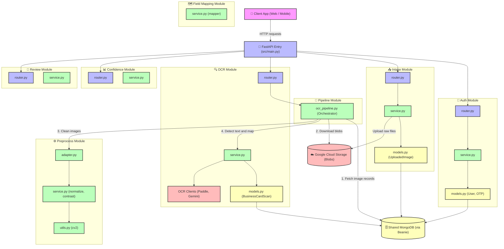

# OCR Document Processing — Backend

FastAPI + Beanie (MongoDB) + ARQ (Redis) + Pydantic v2

## Quick start

```bash
# 1. Clone & setup env
cp .env.example .env
# Edit .env — fill in GEMINI_API_KEY if you're on P4

# 2. Install dependencies
pip install -r requirements/dev.txt

# 3. Run dev server
uvicorn src.main:app --reload

# 4. Run tests
pytest
```

## Dev with Docker

```bash
docker compose -f docker/docker-compose.dev.yml up --build
```

API: http://localhost:8000  
Docs: http://localhost:8000/docs (local/staging only)

## Project structure

```
Cardly-BigProject/
├── src/
│   ├── main.py                         # FastAPI app factory, middleware, router registration
│   ├── config.py                       # Global settings (CORS, MongoDB URL, environment)
│   ├── constants.py                    # App-wide enums & constants
│   ├── database.py                     # Beanie init — registers all Beanie documents
│   ├── exceptions.py                   # Base AppException + global error handlers
│   │
│   ├── auth/                           # 🔐 Authentication & authorisation
│   │   ├── config.py                   # JWT, OTP, SMTP, reset-token settings
│   │   ├── constants.py                # Token type strings (access / refresh)
│   │   ├── dependencies.py             # get_current_user FastAPI dependency
│   │   ├── exceptions.py               # Domain errors (OTP, token, user state)
│   │   ├── models.py                   # User, RefreshToken, OtpCode, PasswordResetSession
│   │   ├── repository.py               # All MongoDB queries — no business logic
│   │   ├── router.py                   # Endpoints: register, login, OTP, forgot-password
│   │   ├── schemas.py                  # Pydantic request / response DTOs
│   │   ├── service.py                  # Business logic layer
│   │   ├── utils.py                    # Re-export shim for auth utilities
│   │   └── utils/
│   │       ├── email.py                # SMTP OTP email sender
│   │       ├── jwt.py                  # Access & refresh token create/decode
│   │       └── otp.py                  # OTP generation & SHA-256 hashing
│   │
│   ├── intake/                         # 📥 Image upload & storage
│   │   ├── config.py                   # Upload limits, allowed mime types
│   │   ├── constants.py                # Intake-specific constants
│   │   ├── dependencies.py             # Intake FastAPI dependencies
│   │   ├── exceptions.py               # Upload domain errors
│   │   ├── models.py                   # UploadedImage document
│   │   ├── router.py                   # Upload endpoints
│   │   ├── schemas.py                  # Request / response DTOs
│   │   ├── service.py                  # Upload logic & GCS blob handling
│   │   ├── test.py                     # Local integration scratch tests
│   │   └── utils.py                    # File validation helpers
│   │
│   ├── preprocess/                     # ⚙️ Image pre-processing
│   │   ├── adapter.py                  # Bridges pipeline → preprocess service
│   │   ├── config.py                   # Preprocess settings
│   │   ├── constants.py                # Preprocess constants
│   │   ├── exceptions.py               # Preprocess domain errors
│   │   ├── models.py                   # PreprocessedImage document
│   │   ├── service.py                  # cv2 normalise / contrast transforms
│   │   └── utils.py                    # Image utility helpers
│   │
│   ├── ocr/                            # 🔍 OCR & AI Vision extraction
│   │   ├── config.py                   # OCR engine settings
│   │   ├── constants.py                # OCR constants
│   │   ├── exceptions.py               # OCR domain errors
│   │   ├── models.py                   # OcrResult, AiVisionResult, BusinessCardScan
│   │   ├── router.py                   # OCR trigger endpoints
│   │   ├── schemas.py                  # Request / response DTOs
│   │   ├── service.py                  # Orchestrates OCR client calls
│   │   ├── utils.py                    # OCR post-processing helpers
│   │   ├── clients/
│   │   │   ├── gemini_client.py        # Gemini AI Vision client
│   │   │   └── paddle_client.py        # PaddleOCR client
│   │   └── sample/                     # Sample images for local OCR testing
│   │       ├── Australia-front-2-1024x609.jpg
│   │       ├── business-card-design-647.webp
│   │       ├── business_cards_mock_up_2.webp
│   │       ├── driven_license.png
│   │       ├── driven_license_front.png
│   │       ├── driven_license_front_challenge.png
│   │       ├── driver_license_after.png
│   │       ├── in-card-visit-5-hop.jpg
│   │       ├── name-card-nhua-qrcode.jpg
│   │       ├── qr-code-name-card.jpg
│   │       ├── the-nhua-qr-code.jpg
│   │       └── [20 additional sample card/licence images]
│   │
│   ├── mapping/                        # 🗺️ Field mapping & normalisation
│   │   ├── config.py                   # Mapping settings
│   │   ├── constants.py                # Mapping constants
│   │   ├── exceptions.py               # Mapping domain errors
│   │   ├── models.py                   # MappedDocument document
│   │   ├── normalizers.py              # Field normalisation rules
│   │   ├── schemas.py                  # Request / response DTOs
│   │   ├── service.py                  # Dispatcher — selects mapper by doc type
│   │   ├── utils.py                    # Mapping utilities
│   │   ├── validators.py               # Field validation rules
│   │   └── mappers/
│   │       ├── base.py                 # Abstract base mapper interface
│   │       └── business_card.py        # Business card field mapper
│   │
│   ├── confidence/                     # 📊 Confidence scoring
│   │   ├── config.py                   # Scoring thresholds
│   │   ├── constants.py                # Scoring constants
│   │   ├── dependencies.py             # Confidence FastAPI dependencies
│   │   ├── exceptions.py               # Scoring domain errors
│   │   ├── models.py                   # ConfidenceReport, ProcessingHistory documents
│   │   ├── router.py                   # Confidence endpoints
│   │   ├── schemas.py                  # Request / response DTOs
│   │   ├── service.py                  # Scoring logic
│   │   └── utils.py                    # Scoring helpers
│   │
│   ├── review/                         # 📝 Human review & finalisation
│   │   ├── config.py                   # Review settings
│   │   ├── constants.py                # Review constants
│   │   ├── dependencies.py             # Review FastAPI dependencies
│   │   ├── exceptions.py               # Review domain errors
│   │   ├── models.py                   # JsonReviewSession, FinalizedDocument documents
│   │   ├── router.py                   # Review & confirm endpoints
│   │   ├── schemas.py                  # Request / response DTOs
│   │   ├── service.py                  # Review session & confirm logic
│   │   └── utils.py                    # Review helpers
│   │
│   ├── enrichment/                     # ✨ AI-powered data enrichment
│   │   ├── config.py                   # Enrichment settings
│   │   ├── constants.py                # Generation status enums
│   │   ├── exceptions.py               # Enrichment domain errors
│   │   ├── models.py                   # Enrichment result document
│   │   ├── router.py                   # Enrichment endpoints
│   │   ├── schemas.py                  # Request / response DTOs
│   │   ├── service.py                  # Gemini grounded enrichment logic
│   │   ├── utils.py                    # Enrichment helpers
│   │   └── clients/
│   │       └── gemini_client.py        # Gemini client factory
│   │
│   ├── pipeline/                       # 🔗 Background task orchestration (ARQ + Redis)
│   │   ├── exceptions.py               # Pipeline domain errors
│   │   ├── ocr_pipeline.py             # End-to-end pipeline orchestrator
│   │   ├── stages.py                   # Individual pipeline stage functions
│   │   ├── tasks.py                    # ARQ task definitions
│   │   └── worker.py                   # ARQ worker entry point
│   │
│   └── common/                         # 🧰 Shared utilities
│       ├── base_model.py               # CustomModel — UTC ISO-8601 datetime serialiser
│       ├── enums.py                    # Shared enumerations
│       ├── pagination.py               # Pagination request / response helpers
│       └── storage.py                  # Google Cloud Storage client utilities
│
├── tests/
│   ├── conftest.py                     # Shared fixtures: DB init, async HTTP client
│   ├── auth/
│   │   ├── conftest.py                 # Auth-local conftest (no full app import)
│   │   ├── test_login.py               # Login & token refresh tests
│   │   └── test_forgot_password.py     # OTP verify, reset token, reuse prevention
│   ├── confidence/
│   │   └── test_scoring.py
│   ├── enrichment/
│   │   └── test_enrichment.py
│   ├── intake/
│   │   ├── test_upload_validation.py
│   │   └── test_image_retrieval.py
│   ├── mapping/
│   │   ├── test_business_card_mapper.py
│   │   ├── test_normalizers.py
│   │   └── test_validators.py
│   ├── ocr/
│   │   └── test_extract.py
│   ├── preprocess/
│   │   └── test_normalize.py
│   └── review/
│       └── test_confirm.py
│
├── docker/
│   ├── Dockerfile
│   ├── docker-compose.yml              # Production compose
│   └── docker-compose.dev.yml          # Dev compose with hot-reload
│
├── docs/
│   ├── api_endpoints.md                # Full API reference
│   ├── erd_eraser.txt                  # ERD source
│   ├── mongo_schema.py                 # MongoDB schema reference script
│   └── team_execution_plan.html        # Team sprint plan
│
├── mock_data/                          # Canonical inter-package contract fixtures
│   ├── auth_feature_mocks.json
│   ├── business_card_mapped.json
│   ├── business_card_ocr_output.json
│   ├── document_full_state.json
│   ├── document_full_state_business_card.json
│   ├── document_full_state_driver_licence.json
│   ├── document_full_state_medicare.json
│   ├── driver_licence_vic_mapped.json
│   ├── driver_licence_vic_ocr_output.json
│   ├── intake_feature_mocks.json
│   ├── medicare_mapped.json
│   ├── medicare_ocr_output.json
│   ├── passport_au_mapped.json
│   ├── passport_au_ocr_output.json
│   ├── preprocess_feature_mocks.json
│   └── review_feature_mocks.json
│
├── requirements/
│   ├── base.txt                        # Core dependencies
│   ├── dev.txt                         # Dev extras (pytest, ruff, httpx, …)
│   └── prod.txt                        # Production-only extras
│
├── scripts/                            # One-off maintenance & seed scripts
│   ├── create_indexes.py               # Ensure MongoDB indexes exist
│   ├── seed_dev_data.py                # Seed local dev database
│   └── prepare_review.py              # Pre-populate review sessions
│
├── .env.example                        # Environment variable template
├── .dockerignore
├── .gitignore
├── pyproject.toml                      # pytest & mypy configuration
├── ruff.toml                           # Ruff linter configuration
└── README.md
```

## Branch naming

`feature/<package>-<description>` — e.g. `feature/mapping-passport-mapper`

## Linting

```bash
ruff check src/ tests/
```

## API endpoints

See [docs/api_endpoints.md](docs/api_endpoints.md) or `/docs` when running locally.
